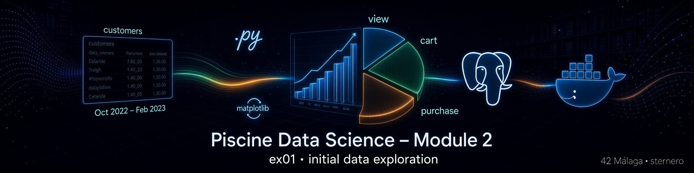
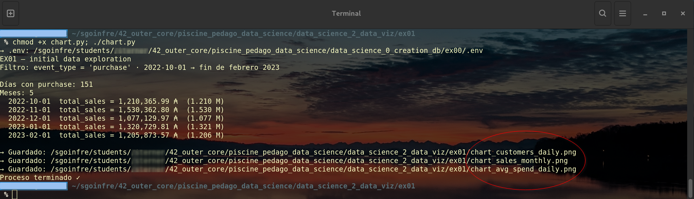
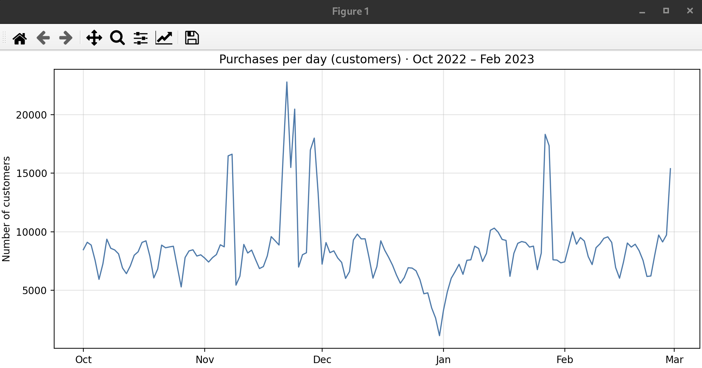
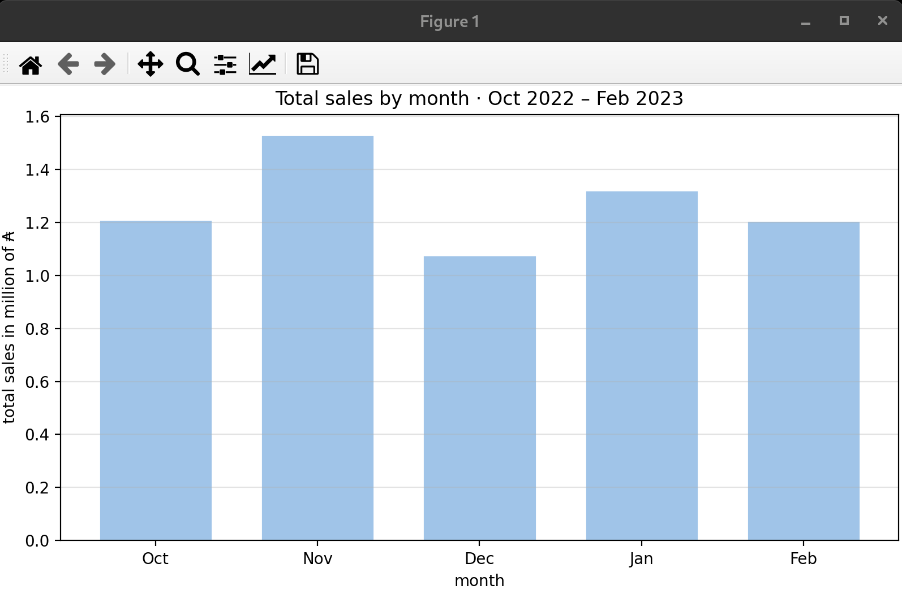
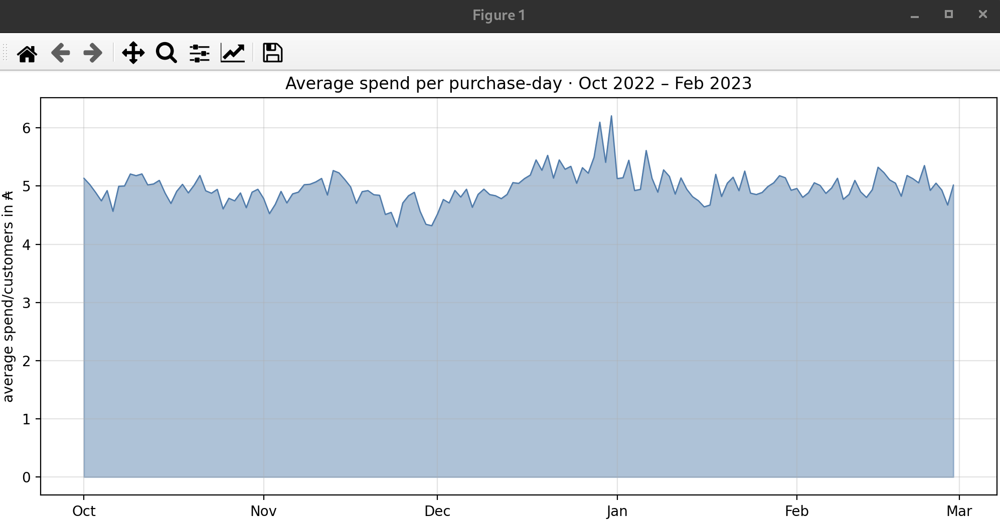

# 📈 Ejercicio 01 – initial data exploration

<p align="center">
  
</p>

[← README Module 2](../README.md) · [← EX00](../ex00/README.md)

---

<a id="indice"></a>
## 📑 Índice

1. [¿Qué se pide?](#que)
2. [Archivos](#archivos)
3. [Prerrequisitos](#prereq)
4. [Los 3 gráficos](#graficos)
5. [SQL (idea)](#sql)
6. [Ejecutar](#ejecutar)
7. [Guía Python](#guia)
8. [Checklist](#checklist)
9. [Navegación](#navegacion)

---

<a id="que"></a>
## 🎯 ¿Qué se pide?

Literalmente (subject):

> Keep only the "purchase" data of 'event_type' column  
> All prices are in Altairian Dollars  
> Create 3 charts from the beginning of October 2022 to the end of February 2023

| Requisito | Detalle |
|-----------|---------|
| Directorio | `ex01/` |
| Entrega | **`chart.*`** |
| Filtro | `event_type = 'purchase'` |
| Fechas | **2022-10-01** → **fin de febrero 2023** (el PDF avisa: incluir febrero) |
| Moneda | Altairian Dollars (₳) |

[↑ Volver al índice](#indice)

---

<a id="archivos"></a>
## 📁 Archivos

| Archivo | Rol |
|---------|-----|
| [`chart.py`](./chart.py) | Tres gráficos + consulta al warehouse (entrega `chart.*`) |
| [`python.md`](./python.md) | Guía didáctica |
| [`start.sh`](./start.sh) | Menú opcional |

<p align="center">
  
</p>

Al ejecutar se generan (opcionales, útiles en defensa):

- `chart_customers_daily.png`

<p align="center">
  
</p>

- `chart_sales_monthly.png`

<p align="center">
  
</p>

- `chart_avg_spend_daily.png`

<p align="center">
  
</p>

[↑ Volver al índice](#indice)

---

<a id="prereq"></a>
## ⚙️ Prerrequisitos

1. Module 0: contenedor `postgres_piscineds` Up.  
2. Module 1: tabla **`customers`** (con febrero si está en el warehouse).  
3. Python 3 + `psycopg2`, `matplotlib`, `python-dotenv` (el script puede instalarlos).

```bash
docker exec -it postgres_piscineds \
  psql -U "$(whoami)" -d piscineds -c \
  "SELECT COUNT(*) FROM customers WHERE event_type = 'purchase';"
```

[↑ Volver al índice](#indice)

---

<a id="graficos"></a>
## 📊 Los 3 gráficos

| # | Tipo | Contenido | Eje Y (como en el PDF) |
|---|------|-----------|-------------------------|
| 1 | **Línea** | Compras (filas `purchase`) por **día** | Number of customers |
| 2 | **Barras** | Suma de `price` por **mes** / 1 000 000 | total sales in million of ₳ |
| 3 | **Área** | `SUM(price)/COUNT(*)` por **día** | average spend/customers in ₳ |

La agregación se hace **en SQL** (no se cargan millones de filas en Python).

[↑ Volver al índice](#indice)

---

<a id="sql"></a>
## 🗄️ SQL (idea)

```sql
-- Solo purchase, rango oct 2022 – feb 2023
WHERE event_type = 'purchase'
  AND event_time >= TIMESTAMP '2022-10-01'
  AND event_time <  TIMESTAMP '2023-03-01'
```

Luego `GROUP BY` día o `date_trunc('month', event_time)`.

[↑ Volver al índice](#indice)

---

<a id="ejecutar"></a>
## ▶️ Ejecutar

```bash
cd data_science_2_data_viz/ex01
python3 chart.py
# sin pantalla:
MPLBACKEND=Agg python3 chart.py
```

O con el asistente:

```bash
chmod +x start.sh && ./start.sh
```

[↑ Volver al índice](#indice)

---

<a id="guia"></a>
## 📘 Guía Python

**[python.md](./python.md)** — filtros, fechas, los tres plots, errores frecuentes.

[↑ Volver al índice](#indice)

---

<a id="checklist"></a>
## ✅ Checklist subject

| Ítem | ☐ |
|------|---|
| Entrega `ex01/chart.*` | ☐ |
| Solo filas `purchase` | ☐ |
| Rango oct 2022 – feb 2023 (con febrero) | ☐ |
| 3 gráficos (línea, barras, área) | ☐ |
| Precios en ₳ (eje / título coherente) | ☐ |

[↑ Volver al índice](#indice)

---

<a id="navegacion"></a>
## 🔗 Navegación

- [← EX00 pie](../ex00/README.md)
- [← Module 2](../README.md)
- [Siguiente: EX02 mustache →](../ex02/README.md)

---

*Piscine Data Science – Module 2 – Data Viz – EX01*  
*sternero – 42 Málaga – Octubre 2026*
