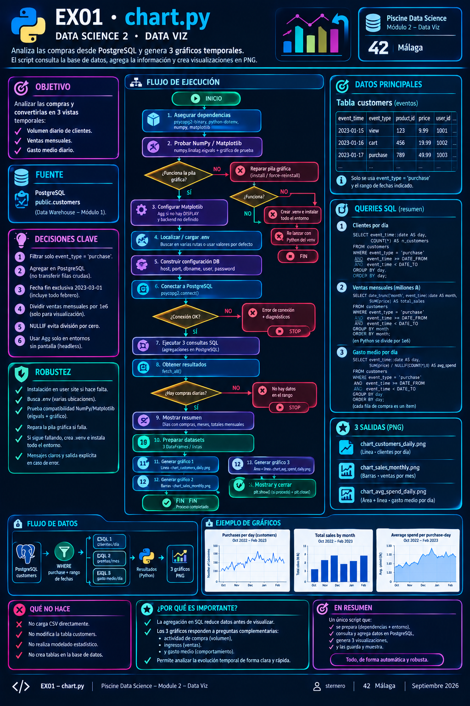

# 🐍 Guía Python – EX01 initial data exploration

<p align="center">
  
</p>

[← README EX01](./README.md) · [← chart.py](./chart.py) · [← Module 2](../README.md) · [EX00 guía](../ex00/python.md)

---

<a id="indice"></a>
## 📑 Índice

### Parte A – Fundamentos (si vienes de EX00 o empiezas aquí)
1. [¿Para quién?](#para-quien)
2. [Qué es un script y `main`](#script)
3. [`import`, `def`, f-strings](#basico)
4. [Listas, tuplas y bucles](#listas)
5. [Fechas en Python y en SQL](#fechas)
6. [Conectar a PostgreSQL (`psycopg2`)](#psycopg2)
7. [Matplotlib: línea, barras y área](#matplotlib)

### Parte B – El `chart.py` de este ejercicio
8. [Qué pide el subject (palabra por palabra)](#subject)
9. [Por qué tres gráficos y no uno](#por-que)
10. [Flujo completo del script](#flujo)
11. [Filtro `purchase` y el rango de fechas](#filtro)
12. [Las tres consultas SQL, una a una](#sql)
13. [Gráfico 1 – clientes por día (línea)](#g1)
14. [Gráfico 2 – ventas por mes (barras)](#g2)
15. [Gráfico 3 – gasto medio (área)](#g3)
16. [Altairian Dollars (₳)](#money)
17. [Backend: ventana vs solo PNG](#backend)
18. [Ejecutar y comprobar](#ejecutar)
19. [Qué decir en la defensa](#defensa)
20. [Errores frecuentes](#errores)
21. [Mini ejercicios de comprensión](#ejercicios)
22. [Glosario](#glosario)

---

<a id="para-quien"></a>
## 👋 ¿Para quién?

Para entender **`chart.py`** de punta a punta: desde “solo quiero comprar en el warehouse” hasta “tres figuras como las del PDF, **con febrero**”.

Si ya leíste [la guía de EX00](../ex00/python.md), la **Parte A** te sonará; puedes saltar a la **Parte B**.  
Si no, la Parte A te deja listo sin asumir experiencia previa.

Al final deberías poder decir en defensa:

> “Filtro `event_type = 'purchase'`, acoto octubre 2022–febrero 2023, agrego en SQL por día o por mes, y dibujo línea, barras y área en Altairian Dollars.”

[↑ Volver al índice](#indice)

---

<a id="script"></a>
## 📜 Qué es un script y `main`

Un archivo `.py` se ejecuta así:

```bash
python3 chart.py
# o
./chart.py          # si tiene shebang y chmod +x
```

Al final del archivo:

```python
if __name__ == "__main__":
    main()
```

- Cuando lanzas **este** archivo, `__name__` vale `"__main__"` → se llama a `main()`.
- Si otro módulo hiciera `import chart`, **no** se ejecutaría el programa entero (solo se cargarían funciones). Eso evita efectos secundarios al reutilizar código.

[↑ Volver al índice](#indice)

---

<a id="basico"></a>
## 🧱 `import`, `def`, f-strings

### `import`

```python
import os                    # entorno (DISPLAY, USER, …)
import sys                   # stderr, exit
from pathlib import Path     # rutas multiplataforma
import matplotlib.pyplot as plt
import matplotlib.dates as mdates   # formatear ejes de fecha
import psycopg2
from dotenv import load_dotenv
```

### `def`

```python
def fetch_all(conn, sql: str):
    """Ejecuta SQL y devuelve todas las filas."""
    with conn.cursor() as cur:
        cur.execute(sql)
        return cur.fetchall()
```

- `conn` es la conexión abierta a PostgreSQL.
- `with conn.cursor()` cierra el cursor al salir del bloque (menos fugas de recursos).

### f-strings

```python
mes = "2022-10-01"
print(f"Desde {mes}")
print(f"Total: {1_286_088:,}")   # 1,286,088
```

[↑ Volver al índice](#indice)

---

<a id="listas"></a>
## 📋 Listas, tuplas y bucles

`fetchall()` de psycopg2 devuelve una **lista de tuplas**:

```python
rows = [
    (date(2022, 10, 1), 1200),
    (date(2022, 10, 2), 980),
]
for day, n in rows:
    print(day, n)
```

En `chart.py` separamos columnas para matplotlib:

```python
days = [r[0] for r in daily_customers]
counts = [int(r[1]) for r in daily_customers]
```

Eso es una **list comprehension**: “para cada fila, quédate con el campo 0 / 1”.

[↑ Volver al índice](#indice)

---

<a id="fechas"></a>
## 📅 Fechas en Python y en SQL

### En PostgreSQL

```sql
event_time >= TIMESTAMP '2022-10-01'
event_time <  TIMESTAMP '2023-03-01'   -- fin de febrero incluido
event_time::date                       -- solo el día (sin hora)
date_trunc('month', event_time)        -- primer instante del mes
```

Usar **`< 2023-03-01`** (exclusivo) es más limpio que `<= 2023-02-28 23:59:59`.

### En matplotlib

```python
import matplotlib.dates as mdates
ax.xaxis.set_major_formatter(mdates.DateFormatter("%b"))  # Oct, Nov, …
ax.xaxis.set_major_locator(mdates.MonthLocator())         # una marca por mes
```

Si el eje X son objetos `date`/`datetime`, matplotlib los entiende; el formateador solo cambia **cómo se escriben**.

[↑ Volver al índice](#indice)

---

<a id="psycopg2"></a>
## 🐘 Conectar a PostgreSQL (`psycopg2`)

Igual que en EX00 / Module 1:

```python
conn = psycopg2.connect(
    host="localhost",
    port=5432,
    dbname="piscineds",
    user="tu_login",
    password="mysecretpassword",
)
```

Las credenciales salen del **`.env` de Module 0** cuando `find_env_file()` lo encuentra.

Flujo típico:

```text
connect → cursor → execute(SQL) → fetchall() → close
```

En `chart.py`, `main()` abre **una** conexión, lanza las **tres** consultas y cierra en un `finally` (aunque falle el SQL).

[↑ Volver al índice](#indice)

---

<a id="matplotlib"></a>
## 📈 Matplotlib: línea, barras y área

Tres ideas repetidas en todo el módulo:

1. **`fig, ax = plt.subplots()`** — lienzo + ejes.
2. **Dibujar** sobre `ax` (`plot`, `bar`, `fill_between`).
3. **`savefig` / `show` / `close`** — guardar, mostrar, liberar memoria.

| Tipo | Método | Uso en EX01 |
|------|--------|-------------|
| Línea | `ax.plot(x, y)` | Clientes (compras) por día |
| Barras | `ax.bar(x, y)` | Ventas mensuales en millones |
| Área | `ax.fill_between(x, y)` + `plot` | Gasto medio diario |

```python
fig, ax = plt.subplots(figsize=(10, 4.5), layout="constrained")
ax.plot(days, counts, color="#4C78A8")
ax.set_ylabel("Number of customers")
ax.grid(True, alpha=0.35)
fig.savefig("chart_customers_daily.png", dpi=150, bbox_inches="tight")
plt.show()
plt.close(fig)
```

`layout="constrained"` y `bbox_inches="tight"` reducen el espacio en blanco del PNG (misma idea que en EX00).

[↑ Volver al índice](#indice)

---

<a id="subject"></a>
## 🎯 Qué pide el subject (palabra por palabra)

| Texto del PDF | Traducción práctica |
|---------------|---------------------|
| Keep only the **"purchase"** data of `event_type` | `WHERE event_type = 'purchase'` |
| All prices are in **Altairian Dollars** | Ejes/títulos en ₳ (no convertir a €) |
| Create **3 charts** | Tres figuras distintas |
| From the beginning of **October 2022** to the end of **February 2023** | `2022-10-01` … fin de febrero |
| Turn-in: **`chart.*`** | En este repo: `chart.py` |

Aviso del subject: *“The graphs above were made without February data, you will have to remake them all with the new data.”*  
→ Tus gráficos **deben** incluir febrero si está en el warehouse.

[↑ Volver al índice](#indice)

---

<a id="por-que"></a>
## 💡 Por qué tres gráficos y no uno

Cada figura responde a una pregunta distinta:

| Pregunta de negocio | Gráfico |
|---------------------|---------|
| ¿Cuántas compras hay cada día? | Línea (volumen diario) |
| ¿En qué mes se factura más? | Barras (totales mensuales) |
| ¿Cuánto se gasta de media por compra/día? | Área (ticket medio temporal) |

Si mezclaras todo en un solo eje, escalas distintas (conteos vs millones de ₳ vs media) lo harían ilegible. El PDF separa las tres vistas a propósito.

[↑ Volver al índice](#indice)

---

<a id="flujo"></a>
## 🔄 Flujo completo del script

<br>
<p align="center">
  
</p>

```text
1. ensure_dependencies()     → psycopg2, dotenv, matplotlib/numpy coherentes
2. Elegir backend            → Agg si no hay DISPLAY; si no, interactivo
3. find_env_file + load_dotenv
4. psycopg2.connect(...)
5. Tres SELECT agregados (día / mes / día)
6. Imprimir resumen en terminal (meses y totales)
7. plot_charts(...)          → 3 figuras, 3 PNG, plt.show() cada una
8. conn.close() / fin
```

### Funciones principales

| Función | Rol |
|---------|-----|
| `ensure_dependencies` | Evitar el choque NumPy/matplotlib del cluster |
| `find_env_file` | Localizar Module 0 `.env` |
| `fetch_all` | Ejecutar un SQL y devolver filas |
| `plot_charts` | Construir las tres figuras |
| `main` | Orquestación y mensajes de error |

[↑ Volver al índice](#indice)

---

<a id="filtro"></a>
## 🔍 Filtro `purchase` y el rango de fechas

En **todas** las consultas:

```sql
WHERE event_type = 'purchase'
  AND event_time >= TIMESTAMP '2022-10-01'
  AND event_time <  TIMESTAMP '2023-03-01'
```

### ¿Por qué no incluir `view` / `cart`?

El subject dice *keep only the purchase data*. Las visitas y el carrito son otra historia (EX00 ya miró la distribución global de `event_type`).

### ¿Por qué `< 2023-03-01`?

Incluye cualquier `event_time` del 28 de febrero (o 29) sin pelearte con la hora. Equivale a “hasta el final de febrero”.

Constantes en el script:

```python
DATE_FROM = "2022-10-01"
DATE_TO = "2023-03-01"  # exclusivo
```

[↑ Volver al índice](#indice)

---

<a id="sql"></a>
## 🗄️ Las tres consultas SQL, una a una

### 1) Clientes (compras) por día

```sql
SELECT
    event_time::date AS day,
    COUNT(*)        AS n_customers
FROM customers
WHERE event_type = 'purchase'
  AND event_time >= TIMESTAMP '2022-10-01'
  AND event_time <  TIMESTAMP '2023-03-01'
GROUP BY event_time::date
ORDER BY day;
```

Cada fila de `customers` con `purchase` cuenta como una unidad en el eje “Number of customers” del PDF (una línea de compra / ítem comprado según el modelo de datos del e-commerce).

### 2) Ventas totales por mes

```sql
SELECT
    date_trunc('month', event_time)::date AS month,
    SUM(price) AS total_sales
FROM customers
WHERE event_type = 'purchase'
  AND event_time >= TIMESTAMP '2022-10-01'
  AND event_time <  TIMESTAMP '2023-03-01'
GROUP BY date_trunc('month', event_time)
ORDER BY month;
```

En Python se divide por `1_000_000` para el eje *total sales in million of ₳*.

### 3) Gasto medio por día

```sql
SELECT
    event_time::date AS day,
    SUM(price) / NULLIF(COUNT(*), 0) AS avg_spend
FROM customers
WHERE event_type = 'purchase'
  AND event_time >= TIMESTAMP '2022-10-01'
  AND event_time <  TIMESTAMP '2023-03-01'
GROUP BY event_time::date
ORDER BY day;
```

`NULLIF(COUNT(*), 0)` evita división por cero (aunque un día sin filas no aparecerá por el `GROUP BY`).

**Por qué no traer todas las filas a pandas:** con ~1 M de purchases, el `GROUP BY` en el servidor es más barato y fiel al estilo “agrega en el warehouse” de la piscine.

[↑ Volver al índice](#indice)

---

<a id="g1"></a>
## 📉 Gráfico 1 – clientes por día (línea)

```python
ax.plot(days, counts, color="#4C78A8", linewidth=1.2)
ax.set_ylabel("Number of customers")
ax.xaxis.set_major_formatter(mdates.DateFormatter("%b"))
ax.xaxis.set_major_locator(mdates.MonthLocator())
ax.grid(True, alpha=0.35)
```

- **X:** días consecutivos del periodo.
- **Y:** número de filas `purchase` ese día.
- En el PDF se ve una línea con picos; con febrero la cola del gráfico se alarga hasta febrero.

Salida: `chart_customers_daily.png`.

[↑ Volver al índice](#indice)

---

<a id="g2"></a>
## 📊 Gráfico 2 – ventas por mes (barras)

```python
sales_m = [float(r[1]) / 1_000_000.0 for r in monthly_sales]
month_labels = [d.strftime("%b") for d in months]  # Oct, Nov, Dec, Jan, Feb
ax.bar(month_labels, sales_m, color="#A0C4E8", edgecolor="white", width=0.7)
ax.set_ylabel("total sales in million of ₳")
```

Comprobación rápida en terminal (el script ya imprime algo similar):

```text
  2022-10-01  total_sales = …  (x.xxx M)
  …
  2023-02-01  total_sales = …  (x.xxx M)
```

Si **no** sale febrero, el warehouse no tiene `data_2023_feb` en `customers` (vuelve a Module 0/1).

Salida: `chart_sales_monthly.png`.

[↑ Volver al índice](#indice)

---

<a id="g3"></a>
## 🟦 Gráfico 3 – gasto medio (área)

```python
ax.fill_between(days3, avgs, color="#4C78A8", alpha=0.45)
ax.plot(days3, avgs, color="#4C78A8", linewidth=0.8)
ax.set_ylabel("average spend/customers in ₳")
```

- `fill_between` pinta el área bajo la curva (como el PDF).
- El valor diario es **media de `price`** de las compras de ese día.

Salida: `chart_avg_spend_daily.png`.

[↑ Volver al índice](#indice)

---

<a id="money"></a>
## ₳ Altairian Dollars

El subject no pide convertir a euros ni a dólares estadounidenses.  
La columna `price` del CSV/warehouse **ya** está en esa unidad ficticia de la consigna.

En los gráficos:

- Barras: *million of ₳* → `SUM(price) / 1e6`.
- Área: *average spend … in ₳* → media de `price`.

Usar el símbolo ₳ en el eje es coherente con el PDF; no es obligatorio para la nota, pero ayuda en defensa.

[↑ Volver al índice](#indice)

---

<a id="backend"></a>
## 🖥️ Backend: ventana vs solo PNG

| Situación | Qué hace `chart.py` |
|-----------|---------------------|
| Hay `DISPLAY` (escritorio campus) | Backend interactivo → **`plt.show()`** abre ventana |
| Sin `DISPLAY` (SSH) | `matplotlib.use("Agg")` → solo PNG |
| `MPLBACKEND=Agg python3 chart.py` | Fuerzas solo PNG |

**Importante:** la función que *prueba* matplotlib **no** debe llamar a `use("Agg")` de forma permanente: si lo hace, en el mismo proceso ya no podrás abrir ventana. (Mismo cuidado que en EX00.)

[↑ Volver al índice](#indice)

---

<a id="ejecutar"></a>
## ▶️ Ejecutar y comprobar

```bash
# 1) Contenedor + purchases en rango
docker exec -it postgres_piscineds \
  psql -U "$(whoami)" -d piscineds -c \
  "SELECT date_trunc('month', event_time)::date AS m,
          COUNT(*), ROUND(SUM(price)::numeric, 2)
   FROM customers
   WHERE event_type = 'purchase'
     AND event_time >= TIMESTAMP '2022-10-01'
     AND event_time <  TIMESTAMP '2023-03-01'
   GROUP BY 1 ORDER BY 1;"

# 2) Script
cd data_science_2_data_viz/ex01
python3 chart.py
# o
MPLBACKEND=Agg python3 chart.py
./start.sh
```

### Checklist mental

1. Tres PNG en `ex01/`.
2. Barras con **5 meses** si febrero está cargado.
3. Solo datos `purchase` (los totales no deben parecerse al pie de EX00).
4. Ejes etiquetados de forma reconocible respecto al PDF.

[↑ Volver al índice](#indice)

---

<a id="defensa"></a>
## 🎤 Qué decir en la defensa (guion corto)

1. **Fuente:** tabla `customers` del Module 1, no CSV sueltos.  
2. **Filtro:** solo `purchase`, del 1 oct 2022 al fin de feb 2023.  
3. **Agregación:** SQL `GROUP BY` día/mes; Python solo dibuja.  
4. **Gráfico 1:** volumen diario de compras.  
5. **Gráfico 2:** facturación mensual en millones de ₳.  
6. **Gráfico 3:** ticket medio diario (área).  
7. **Febrero:** incluido a propósito porque el subject lo exige.

[↑ Volver al índice](#indice)

---

<a id="errores"></a>
## ⚠️ Errores frecuentes

| Síntoma | Causa probable | Qué hacer |
|---------|----------------|-----------|
| `connection refused` | Docker parado | `docker start postgres_piscineds` |
| `relation "customers" does not exist` | Falta Module 1 | Crear `customers` (EX01 M1) |
| Cero filas / sin meses | Sin purchase o mal rango | Revisa `event_type` y timestamps |
| Solo 4 barras (sin Feb) | Warehouse sin febrero | Importar `data_2023_feb` y fusionar |
| NumPy / `_ARRAY_API` | Conflicto matplotlib sistema | Igual que EX00: `numpy==1.26.4` o `.venv` |
| No se abre ventana | Sin `DISPLAY` o backend Agg | Normal en SSH; mira PNG |
| Barras en “unidades raras” | Olvidaste `/ 1e6` | Revisar conversión a millones |

[↑ Volver al índice](#indice)

---

<a id="ejercicios"></a>
## ✏️ Mini ejercicios de comprensión

1. ¿Qué cambia en el gráfico 1 si quitas el filtro `event_type = 'purchase'`?  
2. ¿Por qué `DATE_TO = "2023-03-01"` y no `"2023-02-28"`?  
3. Escribe en una frase la diferencia entre `SUM(price)` mensual y `SUM(price)/COUNT(*)` diario.  
4. Si el evaluador pregunta “¿dónde está febrero?”, ¿qué comando `psql` muestras?

*(Respuestas orientativas: 1) mezclarías views/cart y el eje ya no sería “compras”. 2) límite exclusivo limpio. 3) total facturado vs ticket medio. 4) el `GROUP BY month` del bloque Ejecutar.)*

[↑ Volver al índice](#indice)

---

<a id="glosario"></a>
## 📖 Glosario

| Término | Significado breve |
|---------|-------------------|
| **purchase** | Tipo de evento = compra |
| **event_time** | Timestamp del evento en `customers` |
| **date_trunc('month', …)** | Trunca al inicio del mes |
| **Altairian Dollar (₳)** | Unidad de precio del subject |
| **Agg** | Backend matplotlib sin ventana (solo fichero) |
| **fill_between** | Rellena el área bajo una curva |
| **list comprehension** | `[expr for x in seq]` |
| **Data Warehouse** | Aquí: BD tras Module 1 (`customers`) |

[↑ Volver al índice](#indice)

---

## 📎 Relación con EX00

| EX00 | EX01 |
|------|------|
| Todos los `event_type` | Solo `purchase` |
| Un pie (proporciones) | Tres series temporales |
| Sin filtro de fechas | Oct 2022 – Feb 2023 |
| “Qué hacen” en el sitio | “Cuánto compran y cuándo” |

Misma filosofía: **conectar al warehouse**, **agregar en SQL**, **dibujar en Python**.

---

*Piscine Data Science – Module 2 – Data Viz – EX01 – Guía Python*  
*sternero – 42 Málaga – Octubre 2026*
