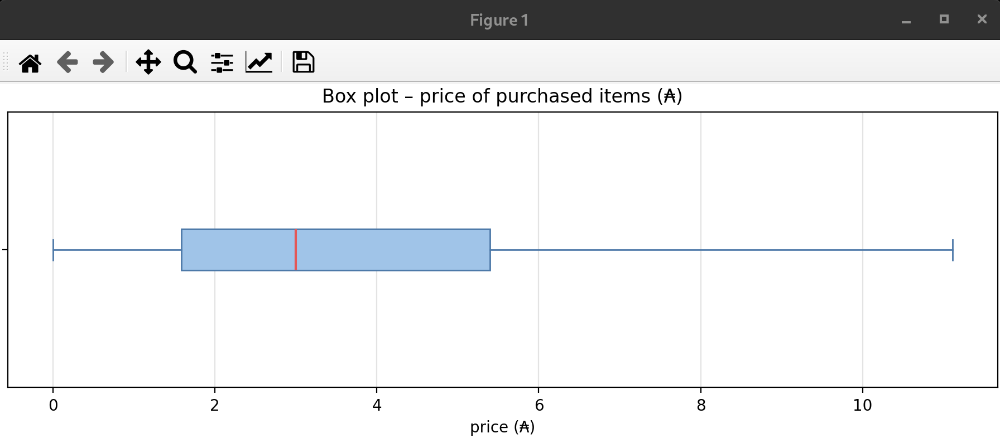
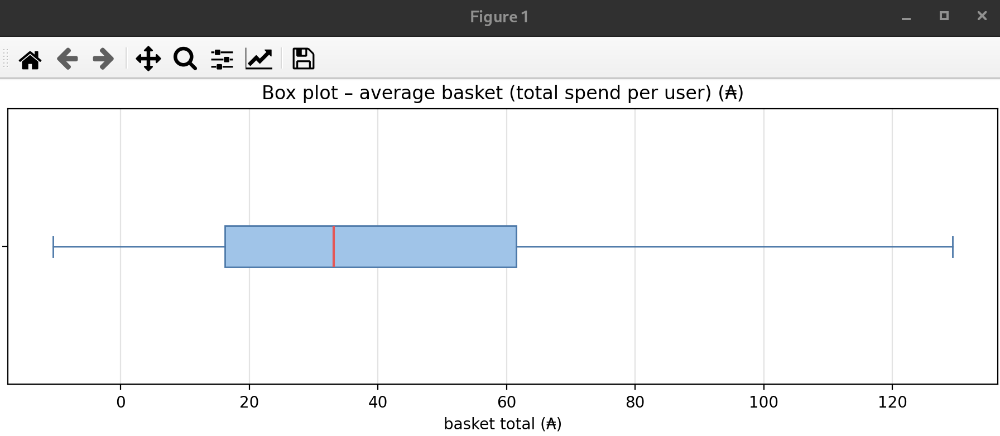
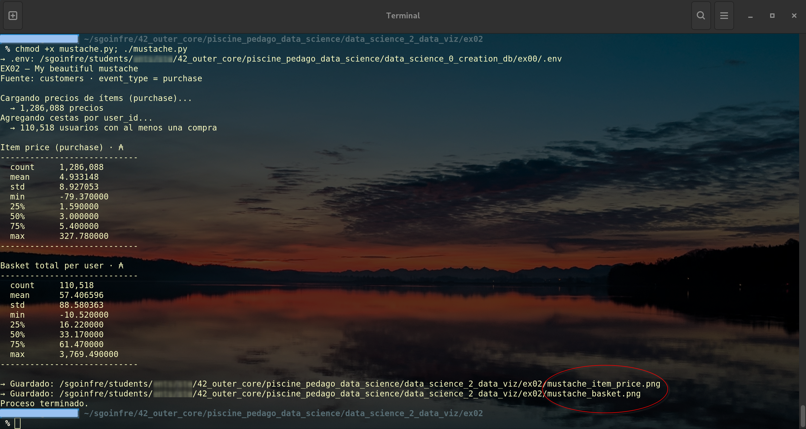

# 📦 Ejercicio 02 – My beautiful mustache

<p align="center">
  
</p>

[← README Module 2](../README.md) · [← EX01](../ex01/README.md)

---

<a id="indice"></a>
## 📑 Índice

1. [¿Qué se pide?](#que)
2. [Archivos](#archivos)
3. [Prerrequisitos](#prereq)
4. [Estadísticas y gráficos](#stats)
5. [Ejecutar](#ejecutar)
6. [Guía Python](#guia)
7. [Checklist](#checklist)
8. [Navegación](#navegacion)

---

<a id="que"></a>
## 🎯 ¿Qué se pide?

Subject (**My beautiful mustache**):

| Requisito | Detalle |
|-----------|---------|
| Directorio | `ex02/` |
| Entrega | **`mustache.*`** |
| Datos | Precios de **purchase** en el warehouse |
| Stats | count, mean, std, min, **25%**, **50%**, **75%**, max |
| Visual | **Box plot** (bigotes / moustaches) |
| Segundo análisis | Precio de la **cesta media** (total por `user_id`) + box plot |

[↑ Volver al índice](#indice)

---

<a id="archivos"></a>
## 📁 Archivos

| Archivo | Rol |
|---------|-----|
| [`mustache.py`](./mustache.py) | Stats + 2 box plots (entrega) |
| [`python.md`](./python.md) | Guía didáctica |
| [`start.sh`](./start.sh) | Menú opcional |

PNG al ejecutar: `mustache_item_price.png`, `mustache_basket.png`.

[↑ Volver al índice](#indice)

---

<a id="prereq"></a>
## ⚙️ Prerrequisitos

- Module 0: PostgreSQL Up  
- Module 1: `customers` con `event_type`, `price`, `user_id`  
- Python: `psycopg2`, `numpy`, `matplotlib`

[↑ Volver al índice](#indice)

---

<a id="stats"></a>
## 📊 Estadísticas y gráficos

### 1) Precio del ítem comprado

```sql
SELECT price FROM customers
WHERE event_type = 'purchase' AND price IS NOT NULL;
```
<p align="center">
  
</p>

Sobre ese vector: **describe** + box plot horizontal.

### 2) Cesta por usuario

```sql
SELECT user_id, SUM(price) AS basket
FROM customers
WHERE event_type = 'purchase' AND price IS NOT NULL
GROUP BY user_id;
```
<p align="center">
  
</p>

Mismo **describe** + segundo box plot.

Los outliers se ocultan por defecto (`showfliers=False`) para que el dibujo se parezca al del PDF (caja y bigotes legibles).

[↑ Volver al índice](#indice)

---

<a id="ejecutar"></a>
## ▶️ Ejecutar

```bash
cd data_science_2_data_viz/ex02
python3 mustache.py
MPLBACKEND=Agg python3 mustache.py
./start.sh
```

<p align="center">
  
</p>

[↑ Volver al índice](#indice)

---

<a id="guia"></a>
## 📘 Guía Python

**[python.md](./python.md)** — percentiles, box plot, cesta por usuario, defensa.

[↑ Volver al índice](#indice)

---

<a id="checklist"></a>
## ✅ Checklist subject

| Ítem | ☐ |
|------|---|
| Entrega `ex02/mustache.*` | ☐ |
| Stats de precios `purchase` | ☐ |
| Box plot de precios | ☐ |
| Análisis de cesta por usuario + box plot | ☐ |

[↑ Volver al índice](#indice)

---

<a id="navegacion"></a>
## 🔗 Navegación

- [← EX01 chart](../ex01/README.md)
- [← Module 2](../README.md)
- [Siguiente: EX03 Building →](../ex03/README.md)

---

*Module 2 – EX02 – sternero – 42 Málaga – Octubre 2026*
