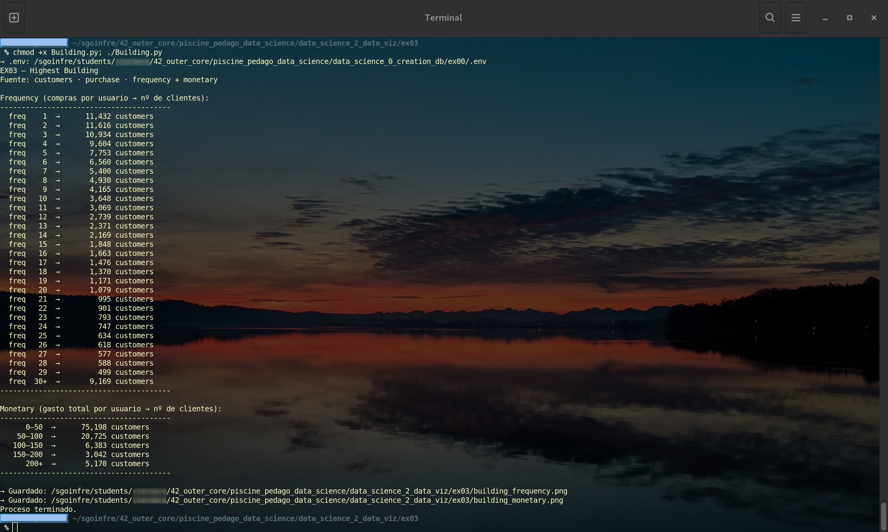
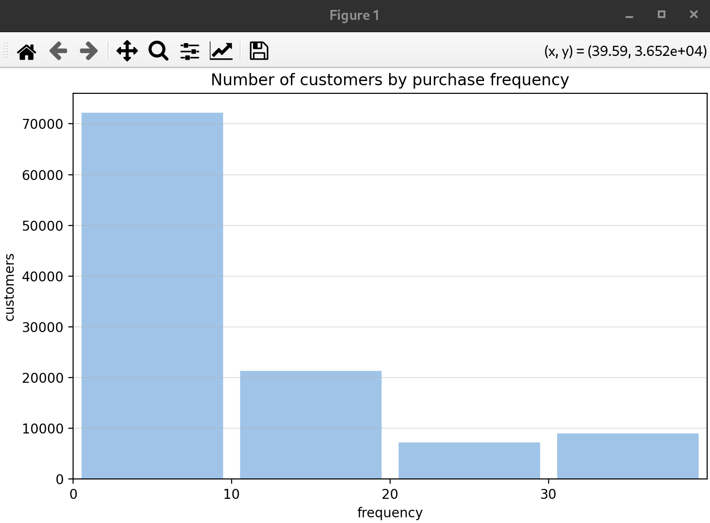
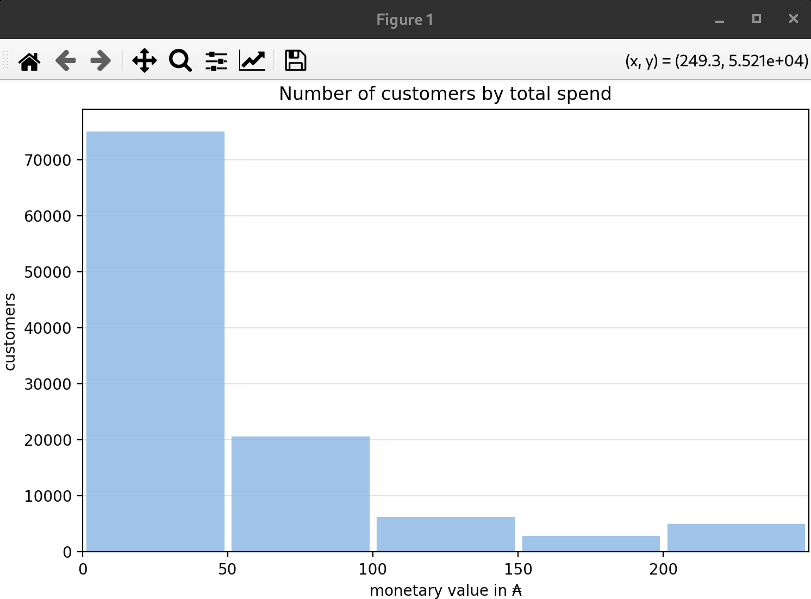
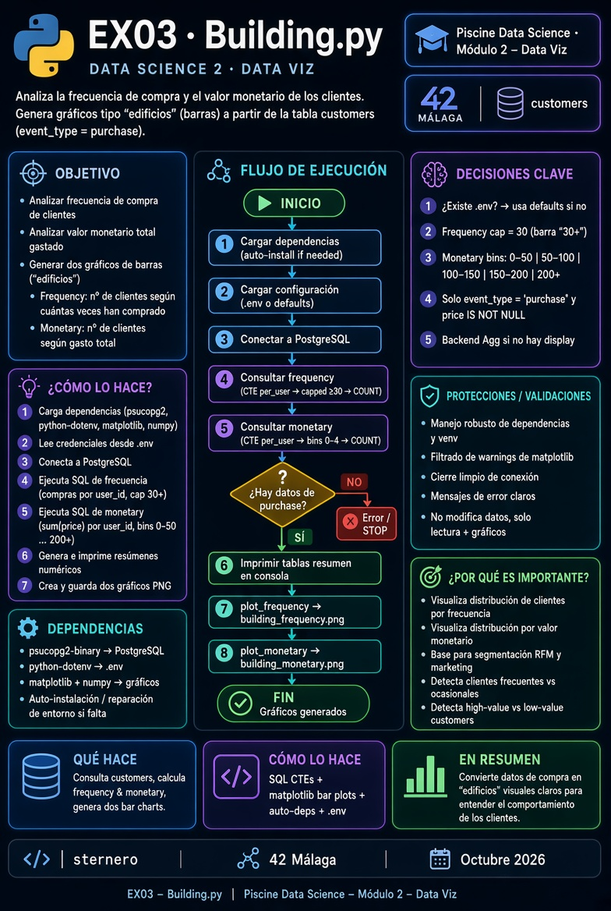

# 🏗️ Ejercicio 03 – Highest Building (Edificio más alto)

<p align="center">
  
</p>

[← README Module 2](../README.md) · [← EX02](../ex02/README.md)

---

<a id="indice"></a>
## 📑 Índice

1. [¿Qué se pide?](#que)
2. [Archivos](#archivos)
3. [Prerrequisitos](#prereq)
4. [Los dos edificios](#edificios)
5. [Bins correctos (como el PDF)](#bins)
6. [SQL (idea)](#sql)
7. [Ejecutar](#ejecutar)
8. [Guía Python](#guia)
9. [Checklist](#checklist)
10. [Navegación](#navegacion)

---

<a id="que"></a>
## 🎯 ¿Qué se pide?

Subject **Highest Building**:

| Requisito | Detalle |
|-----------|---------|
| Directorio | `ex03/` |
| Entrega | **`Building.*`** |
| Análisis | **Frequency** — nº de compras por cliente |
| Análisis | **Monetary** — gasto total por cliente (₳) |
| Visual | Bar charts tipo histograma (skyline / “edificios”) |
| Fuente | Warehouse Module 1 → `customers`, filas `purchase` |

> El PDF se hizo **sin febrero**. Con `data_2023_feb` cambian los conteos; los **bins** deben seguir la figura del subject.

[↑ Volver al índice](#indice)

---

<a id="archivos"></a>
## 📁 Archivos

| Archivo | Rol |
|---------|-----|
| [`Building.py`](./Building.py) | Frequency + monetary (entrega `Building.*`) |
| [`python.md`](./python.md) | Guía didáctica |
| [`start.sh`](./start.sh) | Menú opcional |

<p align="center">
  
</p>

Al ejecutar se actualizan (también para este README):

| PNG | Contenido |
|-----|-----------|
| [`imgs/customers_by_purchase_frecuency.png`](./imgs/customers_by_purchase_frecuency.png) | Frequency |
| [`imgs/customers_by_total_spend.png`](./imgs/customers_by_total_spend.png) | Monetary |
| `building_frequency.png` / `building_monetary.png` | Copias de trabajo en la raíz de `ex03/` |

[↑ Volver al índice](#indice)

---

<a id="prereq"></a>
## ⚙️ Prerrequisitos

1. Module 0: contenedor `postgres_piscineds` **Up**.  
2. Module 1: tabla **`customers`** (`user_id`, `event_type`, `price`).  
3. Python 3 + `psycopg2`, `matplotlib`, `python-dotenv` (el script puede instalarlos).

```bash
docker exec -it postgres_piscineds \
  psql -U "$(whoami)" -d piscineds -c \
  "SELECT COUNT(DISTINCT user_id) AS buyers
   FROM customers WHERE event_type = 'purchase';"
```

[↑ Volver al índice](#indice)

---

<a id="edificios"></a>
## 🏙️ Los dos edificios

| Gráfico | Eje X (como el PDF) | Eje Y | Idea |
|---------|---------------------|-------|------|
| **Frequency** | 0 · 10 · 20 · 30 | customers | Clientes según **tramos** de nº de compras |
| **Monetary** | 0 · 50 · 100 · 150 · 200 | customers | Clientes según **tramos** de gasto total (₳) |

<p align="center">
  
</p>

<p align="center">
  
</p>

La agregación es **por `user_id`**: primero se resume cada cliente; después se cuenta cuántos caen en cada bin.

[↑ Volver al índice](#indice)

---

<a id="bins"></a>
## 📦 Bins correctos (como el PDF)

### Frequency — **no** una barra por cada 1, 2, 3, …

| Tramo | Compras del usuario |
|-------|---------------------|
| **0–10** | 1 ≤ freq &lt; 10 |
| **10–20** | 10 ≤ freq &lt; 20 |
| **20–30** | 20 ≤ freq &lt; 30 |
| **30+** | freq ≥ 30 |

### Monetary — tramos de 50 ₳

| Tramo | Gasto total |
|-------|-------------|
| **0–50** | total &lt; 50 |
| **50–100** | 50 ≤ total &lt; 100 |
| **100–150** | 100 ≤ total &lt; 150 |
| **150–200** | 150 ≤ total &lt; 200 |
| **200+** | total ≥ 200 |

[↑ Volver al índice](#indice)

---

<a id="sql"></a>
## 🗄️ SQL (idea)

```sql
-- Frecuencia por usuario
SELECT user_id, COUNT(*) AS freq
FROM customers
WHERE event_type = 'purchase'
GROUP BY user_id;

-- Gasto total por usuario
SELECT user_id, SUM(price) AS total_spent
FROM customers
WHERE event_type = 'purchase' AND price IS NOT NULL
GROUP BY user_id;
```

Luego `CASE` → bin y `COUNT(*)` de clientes por bin (ver `Building.py`).

[↑ Volver al índice](#indice)

---

<a id="ejecutar"></a>
## ▶️ Ejecutar

```bash
cd data_science_2_data_viz/ex03
python3 Building.py
# sin pantalla:
MPLBACKEND=Agg python3 Building.py
./start.sh
```

Comprobación: la suma de clientes en frequency (y en monetary) =

```sql
SELECT COUNT(DISTINCT user_id)
FROM customers
WHERE event_type = 'purchase';
```

[↑ Volver al índice](#indice)

---

<a id="guia"></a>
## 📘 Guía Python

**[python.md](./python.md)** — bins del PDF, diagrama de flujo, defensa.

<p align="center">
  
</p>

[↑ Volver al índice](#indice)

---

<a id="checklist"></a>
## ✅ Checklist subject

| Ítem | ☐ |
|------|---|
| Entrega `ex03/Building.*` | ☐ |
| Frequency: bins de ancho ~10 (no 1,2,3,…,30) | ☐ |
| Monetary: tramos de ~50 ₳ | ☐ |
| Solo `purchase` / por `user_id` | ☐ |
| PNG actualizados en `imgs/` tras ejecutar | ☐ |

[↑ Volver al índice](#indice)

---

<a id="navegacion"></a>
## 🔗 Navegación

- [← EX02 mustache](../ex02/README.md)
- [← Module 2](../README.md)
- [Siguiente: EX04 Elbow →](../ex04/README.md)

---

*Module 2 – EX03 – sternero – 42 Málaga – 2026*
