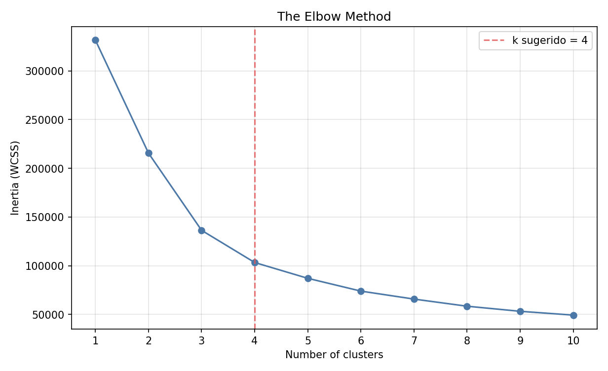

# 🐍 Guía Python – EX04 Elbow

<p align="center">
  
</p>

[← README EX04](./README.md) · [← elbow.py](./elbow.py) · [← Module 2](../README.md)

---

<a id="indice"></a>
## 📑 Índice

### Parte A – Entender sin programar
1. [¿Para quién es esta guía?](#para-quien)
2. [El problema del jefe (en lenguaje humano)](#jefe)
3. [RFM con la analogía de la panadería](#panaderia)
4. [Inertia y el codo, con un ejemplo de cajas](#cajas)
5. [Por qué EX05 empuja a k ≥ 4](#k4)

### Parte B – Qué hace el código
6. [Mapa de `elbow.py`](#mapa)
7. [SQL RFM (la consulta clave)](#sql)
8. [StandardScaler en una frase](#scaler)
9. [Bucle KMeans e inertia](#kmeans)
10. [Cómo se dibuja el gráfico](#plot)
11. [Heurística del k sugerido](#heuristica)

### Parte C – Práctica y defensa
12. [Ejecutar y leer la salida](#ejecutar)
13. [Guion de defensa](#defensa)
14. [Errores frecuentes](#errores)
15. [Mini ejercicios](#ejercicios)
16. [Glosario](#glosario)
17. [Puente EX03 → EX04 → EX05](#puente)

---

<a id="para-quien"></a>
## 👋 ¿Para quién es esta guía?

Para quien llegue a EX04 **sin haber escrito Python antes** y para quien ya programe pero quiera un relato claro de **por qué** este script existe.

Al final deberías poder decir:

> “Agrupo clientes con tres números (reciente / frecuente / gastador), miro dónde la curva del error se aplana, y elijo un número de grupos sensato para las campañas.”

[↑ Volver al índice](#indice)

---

<a id="jefe"></a>
## 👔 El problema del jefe (en lenguaje humano)

Quiere **tipos de cliente** para e-mails distintos.  
Si inventa 50 grupos a ojo, el marketing se vuelve un caos.  
Si pone solo 2, mezcla gente muy distinta en el mismo correo.

El **Elbow** no “adivina la verdad absoluta”: da un **dibujo** para argumentar un compromiso.

[↑ Volver al índice](#indice)

---

<a id="panaderia"></a>
## 🥖 RFM con la analogía de la panadería

Piensa en los clientes de una panadería:

| Idea RFM | Pregunta del panadero | En nuestros datos |
|----------|----------------------|-------------------|
| **Recency** | ¿Cuándo vino la última vez? | Días desde la última `purchase` |
| **Frequency** | ¿Cuántas veces ha venido? | Nº de filas `purchase` del `user_id` |
| **Monetary** | ¿Cuánto se ha dejado en total? | Suma de `price` |

Un cliente que vino ayer, viene casi a diario y gasta mucho **no** debe recibir el mismo mensaje que quien no aparece desde hace meses.

[↑ Volver al índice](#indice)

---

<a id="cajas"></a>
## 📦 Inertia y el codo, con un ejemplo de cajas

Imagina puntos (clientes) en una mesa.  
Pones **k** cajas (grupos) y metes cada punto en la caja del centro más cercano.

- **Inertia** ≈ “qué tan lejos están los puntos del centro de su caja” (suma de distancias al cuadrado).  
- Con **1 caja**, todo el mundo dentro: inertia **alta**.  
- Con **muchas cajas**, cada punto casi solo: inertia **baja**.

El **codo** es el momento en que **abrir otra caja** ya no ordena la mesa de forma clara: la curva se aplana.

<p align="center">
  
</p>

[↑ Volver al índice](#indice)

---

<a id="k4"></a>
## 4️⃣ Por qué EX05 empuja a k ≥ 4

El subject de Clustering habla de **new**, **inactive** y estados de **loyalty** (gold / silver / platinum…).  
Son **como mínimo 4** historias de negocio distintas.  
Por eso el script, si el codo matemático cayera en 2 o 3, **recomienda no bajar de 4** para alinear con EX05.

[↑ Volver al índice](#indice)

---

<a id="mapa"></a>
## 🗺️ Mapa de `elbow.py`

| Bloque | Para qué sirve |
|--------|----------------|
| Cabecera / docstring | Subject y resumen del enfoque |
| `ensure_dependencies` | Instalar lo que falte en el campus (sin drama) |
| Lectura de `.env` | Misma contraseña que Module 0 |
| `SQL_RFM` | Un vector (R, F, M) por cliente |
| `fetch_rfm` | Trae esos números a memoria |
| `elbow_inertias` | Entrena KMeans para cada k y guarda inertia |
| `suggest_k` | Propone un k (codo + suelo 4) |
| `plot_elbow` | Dibuja la curva y guarda PNG |
| `main` | Orquesta todo y escribe mensajes legibles |

[↑ Volver al índice](#indice)

---

<a id="sql"></a>
## 🗄️ SQL RFM (la consulta clave)

Idea (simplificada):

```sql
SELECT
    user_id,
    -- Recency: días desde la última compra
    EXTRACT(EPOCH FROM (NOW() - MAX(event_time))) / 86400.0 AS recency_days,
    COUNT(*) AS frequency,
    SUM(price) AS monetary
FROM customers
WHERE event_type = 'purchase'
GROUP BY user_id;
```

Solo **compras**. Un cliente sin `purchase` no entra en el Elbow de este ejercicio.

[↑ Volver al índice](#indice)

---

<a id="scaler"></a>
## ⚖️ StandardScaler en una frase

Frequency puede ser “5 compras” y Monetary “400 ₳”: sin escalar, el algoritmo miraría casi solo el gasto.  
**StandardScaler** pone cada columna en una escala comparable (media 0, varianza 1).

[↑ Volver al índice](#indice)

---

<a id="kmeans"></a>
## 🔁 Bucle KMeans e inertia

Para cada `k` de 1 a 10:

1. Se piden **k** centros.  
2. Cada cliente se asigna al centro más cercano.  
3. Se recalculan centros.  
4. Se lee `model.inertia_` (WCSS).

Eso es exactamente la lista de puntos del gráfico.

[↑ Volver al índice](#indice)

---

<a id="plot"></a>
## 📈 Cómo se dibuja el gráfico

- Eje X: `Number of clusters` (k)  
- Eje Y: `Inertia (WCSS)`  
- Título: **The Elbow Method** (como el PDF)  
- Línea vertical opcional en el **k sugerido**

[↑ Volver al índice](#indice)

---

<a id="heuristica"></a>
## 🧮 Heurística del k sugerido

1. Se mira el cambio de pendiente de la curva (segunda diferencia de la inertia).  
2. Se toma un candidato de “codo”.  
3. Si ese candidato es &lt; 4, se sube a **4** (coherencia con EX05).

No es un oráculo: es una **ayuda** para argumentar en evaluación.

[↑ Volver al índice](#indice)

---

<a id="ejecutar"></a>
## ▶️ Ejecutar y leer la salida

```bash
MPLBACKEND=Agg python3 elbow.py
```

Busca en consola:

- `Usuarios (RFM): …`  
- líneas `k= 1  inertia=…` … `k=10`  
- `k sugerido …`  
- `→ Guardado: …/elbow_method.png`

[↑ Volver al índice](#indice)

---

<a id="defensa"></a>
## 🎤 Guion de defensa

1. Subject: Elbow para targeting.  
2. Datos: solo `purchase` → RFM por `user_id`.  
3. Escala + KMeans 1…10.  
4. Enseñar el PNG y señalar el codo.  
5. Justificar k (curva + “EX05 pide ≥ 4 grupos”).

[↑ Volver al índice](#indice)

---

<a id="errores"></a>
## ⚠️ Errores frecuentes

| Síntoma | Causa probable | Qué hacer |
|---------|----------------|-----------|
| `No module named sklearn` | Falta scikit-learn | El script intenta instalar; o `pip install --user scikit-learn` |
| Conexión rechazada | Docker parado | `./start.sh` → levantar PostgreSQL |
| Curva rara / todo en un punto | Features sin sentido / pocos users | Revisar que `customers` tenga `purchase` |
| PNG no aparece | Fallo a mitad | Leer el traceback; probar `MPLBACKEND=Agg` |

[↑ Volver al índice](#indice)

---

<a id="ejercicios"></a>
## ✏️ Mini ejercicios

1. Si un cliente compró ayer, ¿su **Recency** es grande o pequeña?  
2. ¿Por qué no usar `event_type = 'view'` para Monetary?  
3. Si la inertia baja muy poco de k=5 a k=10, ¿qué sugiere?

*(1: pequeña. 2: view no es gasto. 3: el codo ya pasó; más clusters aportan poco.)*

[↑ Volver al índice](#indice)

---

<a id="glosario"></a>
## 📖 Glosario

| Término | Significado sencillo |
|---------|----------------------|
| **Cluster** | Grupo de clientes parecidos |
| **KMeans** | Algoritmo que crea k grupos por cercanía |
| **Inertia / WCSS** | “Desorden” interno de los grupos |
| **Elbow** | Zona donde la curva se aplana |
| **RFM** | Recency, Frequency, Monetary |

[↑ Volver al índice](#indice)

---

<a id="puente"></a>
## 🔗 Puente EX03 → EX04 → EX05

| EX03 | EX04 | EX05 |
|------|------|------|
| Histograms de F y M | Elige **cuántos** grupos | **Nombra** y usa los grupos |
| Describe la población | Prepara el k | Campañas (new / inactive / loyalty) |

[↑ Volver al índice](#indice)

---


---

<a id="sklearn-importable"></a>
## 📦 Qué significa «scikit-learn importable» (menú `start.sh`)

En la opción **Estado del entorno**, el asistente hace algo equivalente a:

```bash
python3 -c "import sklearn"
```

| Mensaje | Significado |
|---------|-------------|
| **✓ scikit-learn importable** | Python puede importar el paquete: `KMeans` y `StandardScaler` están disponibles. |
| **⚠ Falta scikit-learn** | Ese `import` falló. Al ejecutar `elbow.py`, el propio script intentará `pip install --user scikit-learn`. |

No es un requisito escrito en el PDF del subject: es un **aviso del menú** para no sorprenderte a mitad de ejecución. La entrega sigue siendo solo **`elbow.*`**.

Tras la primera instalación correcta, el estado suele pasar de ⚠ a ✓.

[↑ Volver al índice](#indice)

---

<a id="ref-ex05"></a>
## 🔗 ¿Por qué se menciona EX05 si aún estamos en EX04?

Es **normal y correcto**. No implica haber hecho ya el Clustering.

- El subject de **EX04** pide elegir un número de clusters para targeting comercial.
- El subject de **EX05** pide **al menos 4 grupos** (new, inactive, loyalty…).
- Hablar de EX05 en EX04 es **orientación del itinerario**: el k que justificas aquí se usará después.
- **No** hace falta tener `Clustering.*` escrito para defender el Elbow.
- **No** conviene implementar el clustering completo dentro de EX04 (eso es EX05).

En defensa puedes decir: *“Elijo k = 4 por el codo y porque el siguiente ejercicio pide ≥ 4 segmentos.”*

[↑ Volver al índice](#indice)

---

<a id="k-detalle"></a>
## 📐 k, inertia y codo — detalle técnico (repaso)

### Fórmula de la inertia (WCSS)

Para un particionado en *k* grupos, con centroide \(\mu_j\) del grupo *j*:

\[
\mathrm{WCSS}(k) = \sum_{j=1}^{k} \sum_{x \in C_j} \| x - \mu_j \|^2
\]

- Cada cliente *x* está en un solo grupo \(C_j\).
- Se suman las distancias **al cuadrado** al centro de su grupo.
- En scikit-learn eso es `model.inertia_` después de `fit`.

### Por qué siempre baja al subir k

Con más grupos, cada punto puede acercarse más a “su” centro. En el extremo, *k* = número de clientes → WCSS → 0. Por eso **no** se elige el *k* de mínima inertia, sino el de **mejor compromiso**.

### Dónde está el codo (idea geométrica)

1. Se calcula WCSS para *k* = 1, 2, …, 10.
2. Se mira cómo cambia la **pendiente** de esa curva (en el código: segundas diferencias discretas).
3. El codo ≈ donde la pendiente deja de caer con fuerza.
4. En datos reales del warehouse, suele situarse hacia **3–4**.
5. Si la heurística diera *k* &lt; 4, el script **sube a 4** para alinear con EX05.

### Números típicos de una corrida (referencia)

| k | Inertia (orden de magnitud) | Lectura |
|---|----------------------------|---------|
| 1 | ~3,3·10⁵ | Todo el mundo en un solo grupo |
| 2–3 | Bajadas grandes | Aún compensa partir |
| **4** | ~1,0·10⁵ | Codo práctico + suelo EX05 |
| 5–10 | Bajadas cada vez menores | Más grupos, poco beneficio extra |

Estos valores dependen del warehouse (p. ej. con febrero incluido); lo estable es **la forma** de la curva, no la cifra exacta.

[↑ Volver al índice](#indice)

*Module 2 – EX04 – Guía Python · sternero – 42 Málaga – Octubre 2026*
