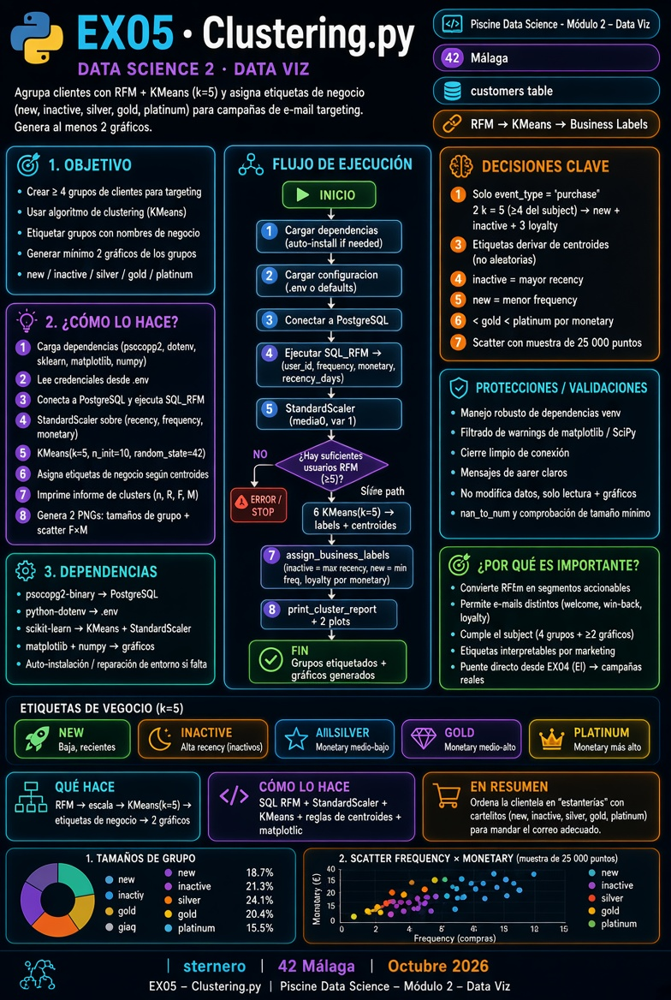
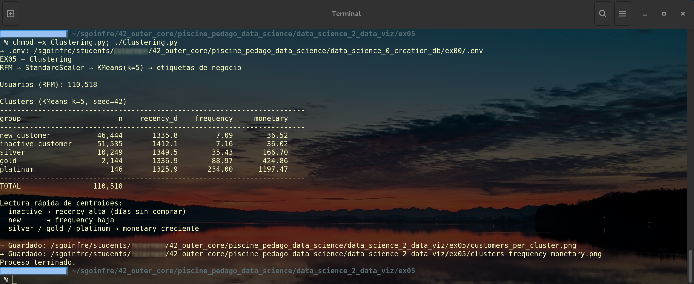
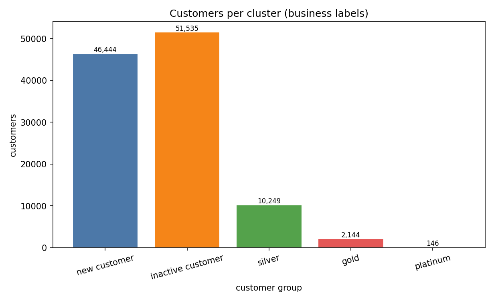
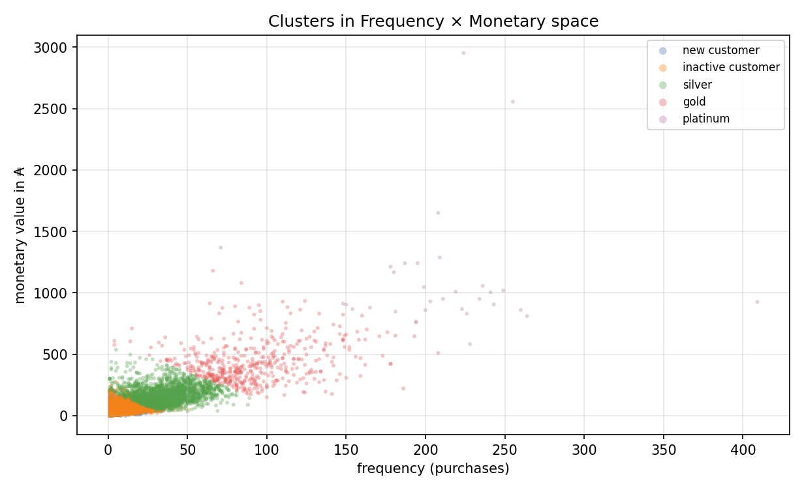

# 🧩 Ejercicio 05 – Clustering

<p align="center">
  
</p>

[← README Module 2](../README.md) · [← EX04 Elbow](../ex04/README.md)

---

<a id="indice"></a>
## 📑 Índice

1. [¿Qué se pide?](#que)
2. [Analogía](#analogia)
3. [Archivos](#archivos)
4. [Prerrequisitos](#prereq)
5. [De EX04 a EX05](#puente)
6. [Los ≥ 4 grupos](#grupos)
7. [Qué hace `Clustering.py`](#flujo)
8. [Ejecutar](#ejecutar)
9. [Defensa](#defensa)
10. [Guía Python](#guia)
11. [Checklist](#checklist)
12. [Navegación](#navegacion)

---

<a id="que"></a>
## 🎯 ¿Qué se pide?

Subject **Clustering**:

| Requisito | Detalle |
|-----------|---------|
| Directorio | `ex05/` |
| Entrega | **`Clustering.*`** |
| Grupos | **Al menos 4** (new, inactive, loyalty gold/silver/platinum…) |
| Algoritmo | **Clustering** (aquí: KMeans) |
| Gráficos | **Mínimo 2** representaciones de los grupos |
| Contexto | Targeting por e-mail (welcome, win-back, status) |

[↑ Volver al índice](#indice)

---

<a id="analogia"></a>
## 🏪 Analogía

EX04 decidió **cuántas** estanterías (k).  
EX05 **coloca** a cada cliente en una estantería y le pone **cartel** (nuevo, inactivo, plata, oro, platino) para el correo correcto.

[↑ Volver al índice](#indice)

---

<a id="archivos"></a>
## 📁 Archivos

| Archivo | Rol |
|---------|-----|
| [`Clustering.py`](./Clustering.py) | Entrega **`Clustering.*`** |
| [`python.md`](./python.md) | Guía didáctica |
| [`start.sh`](./start.sh) | Menú opcional |

PNG generados (raíz de `ex05/`):

| PNG | Contenido |
|-----|-----------|
| [`customers_per_cluster.png`](./customers_per_cluster.png) | Tamaño de cada grupo |
| [`clusters_frequency_monetary.png`](./clusters_frequency_monetary.png) | Scatter F × M por grupo |

[↑ Volver al índice](#indice)

---

<a id="prereq"></a>
## ⚙️ Prerrequisitos

- Module 0: PostgreSQL Up · Module 1: `customers`  
- Python: `psycopg2`, `matplotlib`, `numpy`, **`scikit-learn`**  
- EX04 ayuda a justificar **k ≥ 4** (aquí usamos **k = 5** para los 5 carteles del subject)

[↑ Volver al índice](#indice)

---

<a id="puente"></a>
## 🔗 De EX04 a EX05

| EX04 Elbow | EX05 Clustering |
|------------|-----------------|
| ¿Cuántos grupos? | ¿Quién va a cada grupo? |
| Curva inertia | Etiquetas + gráficos de segmentos |
| k sugerido ≥ 4 | k = 5 (new, inactive, silver, gold, platinum) |

[↑ Volver al índice](#indice)

---

<a id="grupos"></a>
## 🏷️ Los ≥ 4 grupos

Tras KMeans, los **centroides RFM** se interpretan:

| Etiqueta | Lectura típica del centroide |
|----------|------------------------------|
| **new_customer** | Frequency baja (pocas compras) |
| **inactive_customer** | Recency alta (mucho tiempo sin comprar) |
| **silver** | Loyalty intermedio (monetary) |
| **gold** | Loyalty alto |
| **platinum** | Loyalty más alto |

Así se cumple el subject sin inventar etiquetas a ciegas.

[↑ Volver al índice](#indice)

---

<a id="flujo"></a>
## 🔄 Qué hace `Clustering.py`

```text
SQL RFM (purchase / user_id)
  → StandardScaler
  → KMeans(k=5)
  → etiquetas de negocio por centroides
  → tabla en consola
  → gráfico 1: clientes por grupo
  → gráfico 2: scatter Frequency × Monetary
```

<p align="center">
  
</p>

[↑ Volver al índice](#indice)

---

<a id="ejecutar"></a>
## ▶️ Ejecutar

<p align="center">
  
</p>

```bash
cd data_science_2_data_viz/ex05
MPLBACKEND=Agg python3 Clustering.py
python3 Clustering.py
./start.sh
```

<p align="center">
  
</p>
<p align="center">
  
</p>

[↑ Volver al índice](#indice)

---

<a id="defensa"></a>
## 🎤 Defensa

> “Uso RFM (solo purchase), escalo, KMeans con k=5 (≥ 4 del subject).  
> Etiqueto inactive por recency alta, new por frequency baja, y silver/gold/platinum por monetary.  
> Muestro al menos dos gráficos: barras por grupo y scatter F×M.”

[↑ Volver al índice](#indice)

---

<a id="guia"></a>
## 📘 Guía Python

**[python.md](./python.md)** — detalle, analogías y errores frecuentes.

[↑ Volver al índice](#indice)

---

<a id="checklist"></a>
## ✅ Checklist subject

| Ítem | ☐ |
|------|---|
| Entrega `ex05/Clustering.*` | ☐ |
| ≥ 4 grupos con sentido de negocio | ☐ |
| Algoritmo de clustering | ☐ |
| ≥ 2 gráficos de los grupos | ☐ |

[↑ Volver al índice](#indice)

---

<a id="navegacion"></a>
## 🔗 Navegación

- [← EX04 Elbow](../ex04/README.md)
- [← Module 2](../README.md)

---

*Module 2 – EX05 – sternero – 42 Málaga – Octubre 2026*
