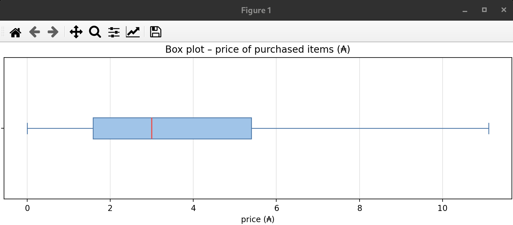
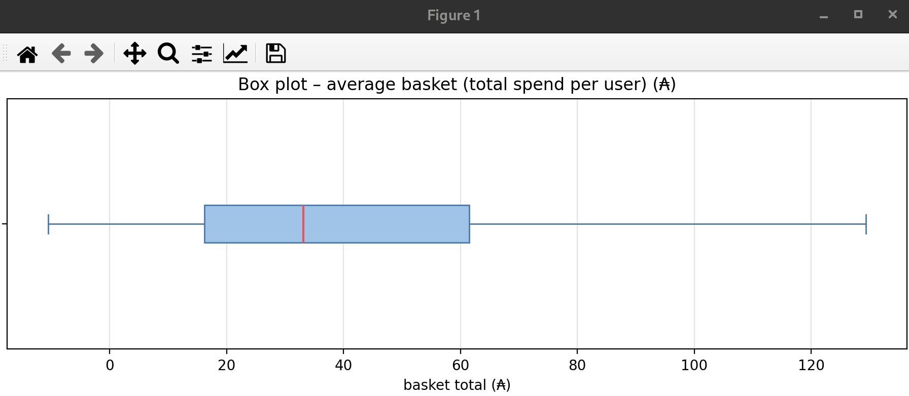

# 📐 Matemáticas del Module 2 – Data Viz

<p align="center">
  
</p>

<br>Este es un documento **didáctico**: no sustituye al subject ni a los scripts (`pie.*`, `chart.*`, …).  
Sirve para **entender con calma** las cuentas que hay detrás de cada gráfico, **sin dar por sentado** que ya sabes estadística o machine learning.

> **Analogía global:** la tabla `customers` es un cuaderno enorme de lo que hizo cada persona en la tienda online.  
> Aquí no inventamos números: **contamos, promediamos, ordenamos y agrupamos** esos apuntes para que un jefe los entienda de un vistazo.

---

## 📑 Índice

1. [Ideas que se repiten en todo el módulo](#ideas-base)
2. [EX00 – Porcentajes y el gráfico de tarta](#ex00)
3. [EX01 – Conteos, sumas y medias en el tiempo](#ex01)
4. [EX02 – Media, mediana, cuartiles y el “bigote”](#ex02)
5. [EX03 – Histogramas: frequency y monetary](#ex03)
6. [RFM – Tres números por cliente](#rfm)
7. [EX04 – Escalado, K-Means e inertia (codo)](#ex04)
8. [EX05 – Mismos grupos, lectura de negocio](#ex05)
9. [Mini glosario](#glosario)
10. [Cómo usarlo en la defensa](#defensa)

---

## 1. Ideas que se repiten en todo el módulo {#ideas-base}

### 1.1 Contar

**Contar** = “¿cuántas filas cumplen esto?”

- En SQL suele ser `COUNT(*)`.
- Ejemplo: ¿cuántos eventos son de tipo `view`?

**Analogía:** en una urna con papeletas de colores, contar las rojas.

### 1.2 Sumar

**Sumar** = juntar cantidades (`SUM(price)`).

- SUM(): Es la función que le dice a la base de datos: "Suma todos los valores de esta columna".
- price: Es el nombre de la columna (en este caso, los precios) que quieres juntar y sumar.

**Analogía:** total de la caja registradora al final del día.

### 1.3 Media (promedio)

$$
\text{media} = \frac{\text{suma de los valores}}{\text{cuántos valores hay}}
$$

**Analogía:** cinco amigos pagan 2, 2, 2, 2 y 100 €. La media es \((2+2+2+2+100)/5 = 21,6 €\).  
La media **se deja arrastrar** por el 100 € (un valor raro).

### 1.4 Valores distintos (DISTINCT)

A veces no queremos contar **filas**, sino **personas**.

- `COUNT(*)` → tickets / eventos.
- `COUNT(DISTINCT user_id)` → clientes diferentes.

**Analogía:** en una cola, la misma persona pasa tres veces. ¿Hay tres personas o una que volvió?

### 1.5 Filtrar

Casi todo EX01–EX05 trabaja solo con **`event_type = 'purchase'`** (compras).  
Es como ignorar “solo miré el escaparate” y quedarte con “pagué en caja”.

### 1.6 Porcentaje

$$
\text{porcentaje de A} = \frac{\text{cantidad de A}}{\text{total}} \times 100
$$

Si hay 100 eventos y 50 son `view` → 50 %.

[↑ Volver al índice](#indice)

---

## 2. EX00 – Porcentajes y el gráfico de tarta {#ex00}

### Qué pregunta responde

> De **todo** lo que pasó en el sitio (mirar, carrito, quitar, comprar…), ¿qué **parte** es cada cosa?

### La cuenta (en palabras)

1. Cuenta cuántos eventos hay de cada `event_type`.
2. Suma todos esos conteos → total.
3. Para cada tipo: \(\text{porción} = \text{conteo} / \text{total}\).

En SQL la idea es:

```sql
SELECT event_type, COUNT(*) AS n
FROM customers
GROUP BY event_type;
```

### Por qué un *pie chart* (tarta)

Cuando la pregunta es **“¿qué fracción del total?”**, un círculo partido en sectores es natural: el área de cada porción **es** ese porcentaje.

**No** sirve bien para “cómo cambió esto mes a mes” (eso es EX01).

### Números típicos en *nuestro* warehouse

Tras Module 1, con ~19 millones de eventos, el orden suele ser:

| Tipo | Orden de magnitud (orientativo) |
|------|----------------------------------|
| `view` | ~ mitad de los eventos |
| `cart` | ~ un tercio o menos |
| `remove_from_cart` | menor |
| `purchase` | la porción **más pequeña** |

Los % exactos salen de **vuestra** BD; el PDF del subject solo muestra un ejemplo.

[↑ Volver al índice](#indice)

---

## 3. EX01 – Conteos, sumas y medias en el tiempo {#ex01}

Tres gráficos; **solo `purchase`**.

### 3.1 Clientes distintos por día

**Pregunta:** cada día, ¿cuántas **personas diferentes** compraron?

**PNG correspondiente:** [`puchases_per_day.png`](./ex01/imgs/puchases_per_day.png)  
Es el gráfico de línea con el número de **clientes distintos por día**.

$$
\text{clientes del día } d = \text{número de } user\_id \text{ distintos con purchase en } d
$$

```sql
SELECT COUNT(DISTINCT user_id) AS clientes_unicos
FROM tu_tabla_de_ventas
WHERE fecha_columna = 'tu_fecha_aqui'  -- Aquí defines el día (d = n)
  AND estado_compra = 'purchase';      -- Aquí filtras solo los que compraron
```


¿Y si quieres ver el cálculo de todos los días por separado?

Si en lugar de un solo día quieres ver una lista con el conteo de cada uno de los días, solo debes agregar un GROUP BY:

```sql
SELECT 
    fecha_columna AS dia,                        -- Fecha en la que se registró la compra
    COUNT(DISTINCT user_id) AS clientes_unicos   -- Cuenta cada cliente una sola vez por día
FROM tu_tabla_de_ventas                          -- Tabla que contiene las ventas
WHERE estado_compra = 'purchase'                 -- Conserva únicamente las compras
GROUP BY fecha_columna                           -- Agrupa todas las compras del mismo día
ORDER BY fecha_columna;                          -- Muestra los días en orden cronológico
```

**Analogía:** no cuentas tickets de caja, cuentas **caras distintas compraron** en la tienda ese día.

### 3.2 Ventas por mes

**Pregunta:** cada mes, ¿cuánto dinero sumaron las compras?

**PNG correspondiente:** [`total_sales_by_months.png`](./ex01/imgs/total_sales_by_months.png)  
Es el gráfico de barras con las **ventas totales de cada mes**.

$$
\text{ventas del mes } m = \sum \text{price de los purchase en } m
$$

Para responder a esta pregunta y generar ese gráfico de barras de ventas mensuales, en SQL usamos una combinación de SUM(price) para sumar el dinero y un GROUP BY para separar los resultados mes por mes.

```sql
SELECT 
    mes_columna AS mes,                 -- Mes en el que se registraron las compras
    SUM(price) AS ventas_totales        -- Suma el precio de todas las compras del mes
FROM tu_tabla_de_ventas                 -- Tabla que contiene las ventas
WHERE estado_compra = 'purchase'        -- Conserva únicamente las compras
GROUP BY mes_columna                    -- Agrupa las ventas correspondientes al mismo mes
ORDER BY mes_columna;                   -- Muestra los meses en orden cronológico
```

**Analogía:** total de la caja de octubre, de noviembre, etc.

### 3.3 Gasto medio por cliente y día

**Pregunta:** el día \(d\), de media, ¿cuánto gastó cada comprador?

**PNG correspondiente:** [`average_spend.png`](./ex01/imgs/average_spend.png)  
Es el gráfico de área con el **gasto medio diario por cliente**.

$$
\text{gasto medio}(d) = \frac{\text{suma de price ese día}}{\text{clientes distintos ese día}}
$$

```sql
SELECT 
    fecha_columna AS dia,                                -- Día en el que se registraron las compras
    SUM(price) / COUNT(DISTINCT user_id) AS gasto_medio  -- Ventas del día divididas entre sus clientes
FROM tu_tabla_de_ventas                                  -- Tabla que contiene las ventas
WHERE estado_compra = 'purchase'                         -- Conserva únicamente las compras
GROUP BY fecha_columna                                   -- Calcula un resultado independiente por día
ORDER BY fecha_columna;                                  -- Muestra los días en orden cronológico
```

**Analogía:** un día pueden pasar pocas personas pero comprar caro → media alta; o muchas personas comprando barato → media más baja.

### Por qué “líneas” y “barras” en el tiempo

En estos gráficos, el eje X representa el **tiempo**: cada punto o barra corresponde a
un día o a un mes. Al colocar las fechas en orden, podemos **comparar periodos y detectar
la evolución de las compras**: subidas, bajadas, picos o temporadas con más actividad.
La línea resulta especialmente útil para seguir una tendencia, mientras que las barras
facilitan comparar cantidades entre meses.

Un *pie chart* (como el que tenemos en ex00) responde a otra pregunta: **cómo se reparte un total entre varias
categorías**. Sus sectores muestran proporciones, pero no colocan los datos en una
secuencia temporal; por eso no es adecuado para observar cómo cambian las ventas de un
mes a otro.

[↑ Volver al índice](#indice)

---

## 4. EX02 – Media, mediana, cuartiles y el “bigote” {#ex02}

En EX02, los apartados **4.1, 4.2 y 4.3** explican los valores estadísticos
que se calculan, pero no tienen un PNG independiente: esos valores se resumen
visualmente dentro de los box plots del apartado 4.4.

### Qué vemos en cada box plot

#### `box_plot_price.png`: precio de los artículos comprados



Cada valor representa el `price` de una línea `purchase`, es decir, el precio
de un artículo comprado. La caja contiene el 50 % central de esos precios:
su extremo izquierdo es Q1, la línea roja es la mediana (Q2) y su extremo
derecho es Q3. Los bigotes muestran el rango de valores que el gráfico no
considera extremos. En esta imagen no aparecen puntos de *outliers* porque el
script los oculta con `showfliers=False`.

La caja es bastante más ancha hacia la derecha y el bigote derecho es largo:
esto indica que hay más dispersión entre los precios altos y algunos productos
son mucho más caros que los precios habituales. La media, que se imprime en la
consola pero no se dibuja como una línea, puede verse afectada por esos valores
altos.

#### `box_plot_average.png`: precio medio por usuario



Aquí cada valor representa el precio medio de los artículos comprados por un
usuario: primero se calcula `AVG(price)` agrupando por `user_id` y después se
construye el box plot con esas medias. Por eso este gráfico responde a una
pregunta distinta: no describe cada artículo, sino el precio típico de compra
de cada cliente.

La caja muestra el 50 % central de las medias de los usuarios. En comparación
con el gráfico anterior, la escala es mucho mayor y la caja se extiende
aproximadamente entre los 16 y los 62 ₳, con una mediana cercana a 33 ₳. El
bigote derecho llega aproximadamente a 130 ₳, lo que muestra que algunos
usuarios tienen una media de compra bastante más alta. Como en el gráfico
anterior, los posibles *outliers* no se dibujan.

### 4.1 Media vs mediana (con paciencia)

Ordena los precios de menor a mayor.

- **Mediana** = valor del **medio** (o media de los dos centrales si hay cantidad par).  
  **Analogía:** la persona del centro en una fila ordenada por altura. Un gigante al final **no** mueve al del centro.
- **Media** = suma / n. Un gigante **sí** sube la media.

Por eso en precios de tienda (muchos baratos + algunos carísimos) la **mediana** suele describir mejor “lo típico”.

Como SQL no tiene una función simple llamada MEDIAN() en todos los sistemas, tenemos que usar una función especial de "percentiles" que hace exactamente lo que necesitamos: ordenar los precios y busca el valor del centro (el percentil 0.50). En la mayoría de bases de datos modernas (como PostgreSQL, Oracle o Redshift), se escribe así:

```sql
SELECT 
    PERCENTILE_CONT(0.50)                  -- Percentil 50: la mediana de los precios
    WITHIN GROUP (ORDER BY price)          -- Ordena los precios antes de localizar el centro
    AS precio_mediana                      -- Nombre del resultado calculado
FROM tu_tabla_de_ventas                    -- Tabla que contiene las ventas
WHERE estado_compra = 'purchase';          -- Conserva únicamente las compras
```

### 4.2 Cuartiles (Q1, Q2, Q3)

Si ordenas todos los precios:

| Nombre | Significado cotidiano |
|--------|------------------------|
| **Mínimo** | el más barato |
| **Q1 (25 %)** | el 25 % más barato queda por debajo |
| **Q2 (50 %)** | la mediana |
| **Q3 (75 %)** | el 75 % queda por debajo |
| **Máximo** | el más caro |

**Analogía:** divides la fila ordenada en cuatro tramos iguales de personas; los cortes son los cuartiles.

En Python suele usarse algo como `np.percentile(array, 25)` → Q1.

### 4.3 Desviación típica (std)

Mide, a grosso modo, **cuánto se alejan** los valores de la media.  
Si todos los precios son casi iguales → std pequeña. Si hay de 1 A a 300 A → std grande.

No hace falta derivar la fórmula en defensa; sí decir: “dispersión respecto a la media”.

### 4.4 Box plot (“mustache”)

Es un **resumen dibujado** de lo anterior:

```text
        |-----[====|====]-----|     •  •
      bigote  Q1  mediana Q3  bigote   outliers
```

- **Caja:** de Q1 a Q3 (la “mitad central” de los datos).
- **Raya en la caja:** mediana.
- **Bigotes:** hasta valores aún “no extremos” (según la regla del programa).
- **Puntos sueltos:** *outliers* (valores raros).

**Dos box plots del subject:**

1. **Precios de ítem** → cada compra aporta su `price`.
   PNG: [`box_plot_price.png`](./ex02/imgs/box_plot_price.png)
2. **Cesta media por usuario** → primero, para cada cliente, `AVG(price)` de sus compras; luego el box sobre esas medias.
   PNG: [`box_plot_average.png`](./ex02/imgs/box_plot_average.png)

`mustache_python.png` es una captura explicativa del código y
`mustache_diagrama_flujo.png` es un diagrama del proceso; no son los dos
box plots resultantes del ejercicio.

**Analogía:** (1) mira el precio de cada producto en el ticket; (2) mira “cómo de generoso es cada cliente de media”.

[↑ Volver al índice](#indice)

---

## 5. EX03 – Histogramas: frequency y monetary {#ex03}

### 5.1 Frequency (frecuencia)

1. Por cada `user_id`: cuántas compras tiene → un número entero (1, 2, 15, 40…).
2. Se meten esos números en **cajones (bins)**, p. ej. en este proyecto:

| Bin | Frecuencia de compra |
|-----|----------------------|
| 0–10 | 1 a 9 compras (según el corte del script) |
| 10–20 | … |
| 20–30 | … |
| 30+ | 30 o más |

3. Cada barra del gráfico = **cuántos clientes** cayeron en ese cajón.

**Analogía:** clasificas a los socios del gimnasio por “veces que vinieron al mes” y levantas un edificio por cada rango.

### 5.2 Monetary (gasto)

Igual, pero el número por cliente es **la suma de lo gastado** (`SUM(price)`), y los bins son rangos de dinero (0–50 A, 50–100 A, …).

### Por qué se parecen a “edificios”

Barras altas a la **izquierda** = muchos clientes compran poco / gastan poco.  
Cola a la **derecha** = pocos clientes muy activos o que gastan mucho.

Eso es **información de negocio**, no solo un dibujo bonito.

[↑ Volver al índice](#indice)

---

## 6. RFM – Tres números por cliente {#rfm}

Antes de agrupar clientes (EX04–EX05), se resume cada uno en pocas medidas. La idea clásica **RFM**:

| Letra | Nombre | Idea en cristiano | Ejemplo de cálculo (purchase) |
|-------|--------|-------------------|--------------------------------|
| **R** | *Recency* | ¿Hace cuánto compró por última vez? | Días (o meses) desde el último `purchase` |
| **F** | *Frequency* | ¿Cuántas veces ha comprado? | `COUNT(*)` de purchase por usuario |
| **M** | *Monetary* | ¿Cuánto dinero ha dejado? | `SUM(price)` por usuario |

**Analogía:** de cada cliente del bar guardas: “¿cuándo vino la última vez?”, “¿cuántas veces al mes?” y “¿cuánto se gasta?”.

Con solo tres números puedes **comparar** clientes entre sí.  
Eso alimenta el clustering.

[↑ Volver al índice](#indice)

---

## 7. EX04 – Escalado, K-Means e inertia (codo) {#ex04}

### 7.1 ¿Por qué escalar? (`StandardScaler`)

R, F y M **no están en las mismas unidades**: días, conteos, euros.

**Analogía:** comparar alturas en metros con pesos en gramos sin convertir: el peso “gana” siempre porque los números son más gordos.

`StandardScaler` pone cada variable en una escala comparable (media 0, dispersión 1, a grandes rasgos). Así K-Means no se obsesiona solo con la variable de números más grandes.

### 7.2 K-Means en una frase

1. Eliges **k** = cuántos grupos quieres.
2. El algoritmo coloca **k centros** (centroides).
3. Cada cliente se asigna al centro **más cercano**.
4. Se recalculan los centros y se repite hasta estabilizarse.

**Analogía:** en un mapa de puntos (clientes), pones k chinchetas y cada punto se queda con la chincheta más cercana; luego mueves las chinchetas al centro de “sus” puntos, y otra vez.

### 7.3 Inertia (WCSS)

Para un **k** fijo, la *inertia* mide cuánto de “desparramados” están los puntos respecto a su centro:

- Si los grupos están **muy compactos** → inertia **baja**.
- Si están **mezclados** → inertia **alta**.

Al **subir k**, la inertia **siempre puede bajar** un poco (más chinchetas = cada punto puede estar más cerca de alguna).  
Por eso no se elige el k con inertia mínima a lo loco (el mínimo extremo sería un grupo por cliente).

### 7.4 Método del codo (*Elbow*)

Se dibuja:

- Eje X: \(k = 1, 2, 3, \ldots, 10\) (en este proyecto).
- Eje Y: inertia de ese k.

La curva **baja fuerte** al principio y luego **se aplana**. La zona donde “deja de compensar” añadir grupos es el **codo**.

**Analogía:** doblar el brazo: el codo es el cambio de dirección; más allá, el antebrazo sigue pero ya no es el pliegue principal.

### 7.5 Elegir k = 5 en este repo

- El subject de EX05 pide **al menos 4** perfiles de negocio (nuevos, inactivos, loyal…).
- El codo se interpreta en la zona ~3–5.
- Este proyecto fija **`SELECTED_K = 5`** y debe **defenderse en voz alta** (no es un dogma del PDF).

[↑ Volver al índice](#indice)

---

## 8. EX05 – Mismos grupos, lectura de negocio {#ex05}

### Matemáticamente

1. Mismo RFM (solo purchase).
2. Mismo tipo de escalado.
3. **Mismo k** que en EX04 (la hoja de evaluación lo exige).
4. K-Means asigna a cada cliente un número de grupo 0…k−1.
5. Vosotros **etiquetáis** esos grupos con lenguaje de negocio (new, inactive, silver, gold, platinum…).

### Gráficos

- **Tamaño de cada grupo:** barras con cuántos clientes hay en cada etiqueta.
- **Comportamiento:** puntos o resúmenes en un plano (p. ej. frecuencia vs gasto) para ver si los grupos se **separan** de verdad.

**Analogía:** no basta decir “hay cinco cajones”; hay que decir **quién** hay en cada cajón y **para qué email** serviría (bienvenida, cupón de retorno, VIP…).

[↑ Volver al índice](#indice)

---

## 9. Mini glosario {#glosario}

| Término | En una línea |
|---------|----------------|
| **Agregación** | Resumir muchas filas en un número (suma, conteo, media). |
| **Bin / cajón** | Intervalo donde agrupas valores para un histograma. |
| **Centroide** | “Centro” de un grupo en K-Means. |
| **Cluster** | Grupo de clientes parecidos según el algoritmo. |
| **Distribución** | Cómo se reparte un conjunto de valores (muchos bajos, pocos altos…). |
| **Histograma** | Barras que cuentan cuántos caen en cada cajón. |
| **Outlier** | Valor raro, muy lejos del resto. |
| **Proporción** | Parte / total (base del pie chart). |
| **RFM** | Recency, Frequency, Monetary. |
| **Scaler** | Transformación para que variables distintas sean comparables. |

[↑ Volver al índice](#indice)

---

## 10. Cómo usarlo en la defensa {#defensa}

No hace falta recitar fórmulas. Sí poder decir, con calma:

1. **EX00:** “Cuento eventos por tipo y cada porción es conteo/total.”
2. **EX01:** “Solo purchase; DISTINCT para personas; SUM para dinero; media = dinero/personas.”
3. **EX02:** “Mediana no se vuelve loca con un precio extremo; la caja es Q1–Q3.”
4. **EX03:** “Un número por cliente (veces o dinero), cajones, altura = cuántos clientes.”
5. **EX04:** “Escalo RFM, pruebo varios k, miró dónde se aplana la inertia, elijo k y lo justifico.”
6. **EX05:** “Mismo k; cada grupo es un tipo de cliente para el negocio.”

---

### Relacionado en este repo

| Recurso | Rol |
|---------|-----|
| `ex0N/python.md` | Cómo está escrito el código |
| `ex0N/README.md` | Subject, defensa, checklist del ejercicio |
| `evaluation.sh` | Guía de defensa (no es entregable del subject) |

---

*mates.md · Module 2 Data Viz · material de apoyo · no sustituye en.subject.pdf*
